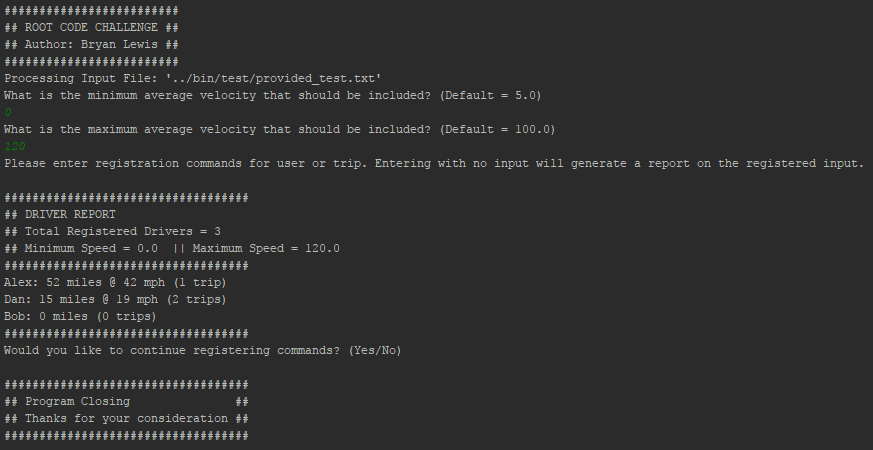

<h2>Root Insurance Code Challenge</h2>
<h4>Author: Bryan Lewis</h4>
<h4>Usage</h4>

Ruby process initiated by command line by calling '/lib/Root_CC.rb' followed by space delimited input arguments that match files either fully qualified or relative to 'Root_CC.rb'.

After the program starts you will be prompted to input the minimum and maxiumum acceptable average trip velocity to include in reporting, if you prefer to keep the defaults you can just enter any non-float value to continue.

Once the program is configured you can begin inputting the command arguments 'Trip' and 'Driver', once an empty input is registered it will print a report of the current drivers registered.

After the report is outputted you will get the option to continue inputting commands, where if you want to continue you get the option to clear the currently stored driver registration history.

If you do not want to continue after a report just enter an empty command and it terminate the program.

<h4>Approach</h4>

My approach for this program was to aim for a simple, but extensible solution while adding a few additional features that were not in the requirements.

The first design decision was how to store the dataset that was registered, I chose a singleton based hashmap structure to allow easy management and accessibility throughout the project structure.

Secondly I wanted a way to deal with registering trip data for drivers that were not yet registered, so I created a driver class that has a property of registered that filters out non-registered users for the Driver Report

After I initializing how and where I store my data model I developed the interface of how to manage user input (both through file and CLI), where I landed on using regular expressions to determine valid and invalid user commands. The regular expressions were built to allow easy access to the capture groups of relevant data I wanted.

Another caveat I wanted to include with my user input was a way to generate a report mid-run and continue on the store -- or clear it and start generating a new report.

With the data model and input registration fleshed out the remainder was tying all the individual processes together and making sure end-to-end testing was successful.

<h4>Example Output From Given Test</h4>

